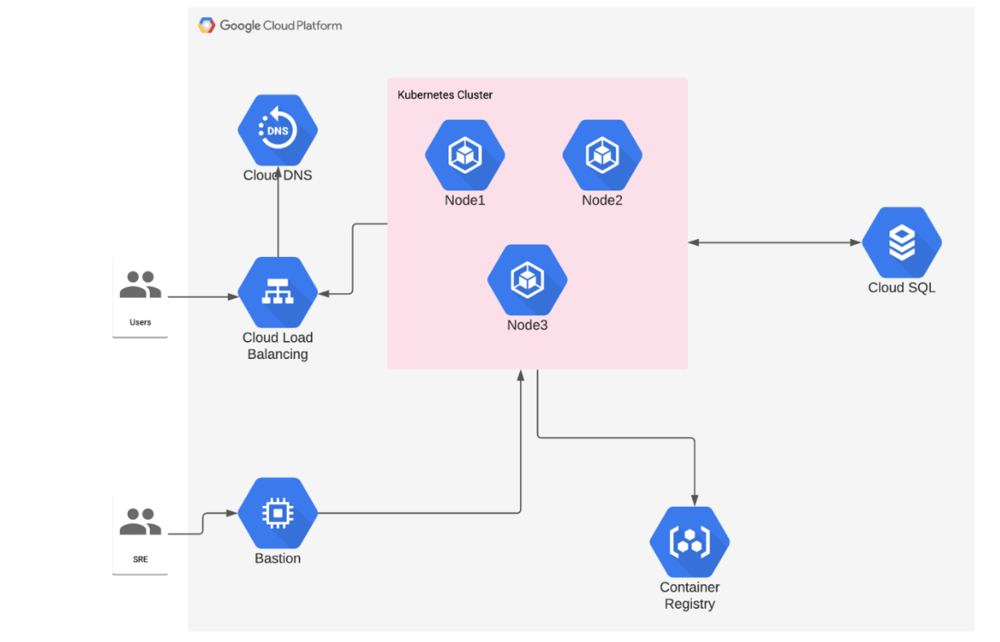

# equifax-sre-challenge

Version desarrollada para desafio en GCP

## Descripción

Este proyecto se basa en la creación de una infraestructura en GCP para la implementación de una aplicación web. La
infraestructura se compone de los siguientes elementos:

- **Cluster GKE**: Se ha creado un cluster de Kubernetes con 3 nodos.
- **Load Balancer**: Se ha creado un balanceador de carga para el acceso a la aplicación.
- **Instancia de VM**: Se ha creado una instancia de VM con una imagen de Ubuntu 20.04.

Para el projecto web se ha utilizado laravel y se ha creado un contenedor con la aplicación.

## Contenido del Repositorio

- **infra**: Contiene los archivos de configuración de Terraform para la creación de la infraestructura.
- **helm**: Contiene los archivos de configuración de Helm para la creación de los recursos de Kubernetes.
- **src**: Contiene el código fuente de la aplicación web.
- **Dockerfile**: Archivo para la creación de la imagen de la aplicación.
- **Makefile**: Archivo con comandos para la creación de la imagen y la infraestructura.
- **README.md**: Archivo con la documentación del proyecto.
- **docker-compose.yml**: Archivo para la creación de la imagen de la aplicación.

## Arquitectura

La arquitectura de la infraestructura se muestra en la siguiente imagen:



## Requerimientos

- Crear una cuenta en Terraform Cloud (para el backend storage)
- Crear un projecto en GCP
- Crear un archivo `.envrc` con las siguientes variables:

```bash
export GOOGLE_CLOUD_PROJECT=""
export GOOGLE_CLOUD_REGION=""
export GOOGLE_CLOUD_ZONE=""
export TF_TOKEN_app_terraform_io=""
export GOOGLE_APPLICATION_CREDENTIALS=""
```

## Implementación


Para la implementación de la infraestructura se deben seguir los siguientes pasos:

1. Clonar el repositorio:

```bash

git clone https://github.com/caherrera/equifax-sre-challenge-aws.git

```

2. Conectar el cli con el projecto de GCP: 

```bash
gcloud auth login
gcloud config set project $GOOGLE_CLOUD_PROJECT
make login-gcr
make docker-login 
```

3. Crear la infraestructura con Terraform:

```bash
cd infra
make all
```
4. Crear la imagen de la aplicación:

```bash
make docker-build
```

5. Subir la imagen al registry de GCP:

```bash
make docker-push
```

6. Desplegar la aplicación en Kubernetes:

```bash
make helm-install
```